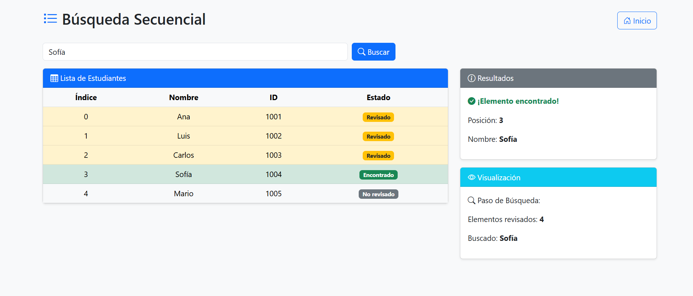

# Sistema de Búsqueda de Estudiantes

Este proyecto es una aplicación web desarrollada con Flask que permite realizar búsquedas secuenciales y binarias sobre una lista simulada de estudiantes. Incluye ejemplos visuales de los algoritmos de búsqueda y una interfaz sencilla para practicar conceptos de estructuras de datos.

## Características

- Búsqueda secuencial por nombre.
- Búsqueda binaria por ID (requiere lista ordenada).
- Visualización de los pasos del algoritmo.
- Interfaz web amigable con Bootstrap.

## Menú En Ejecución


- Buscar por nombre: Ingresa "Sofía" y verás si existe en la lista.
  


- Buscar por ID: Ingresa "1005" y verás si existe en la lista ordenada.


## Instalación

1. Clona el repositorio o descarga los archivos.
2. Instala las dependencias necesarias:
    ```bash
    pip install flask
    ```
3. (Opcional) Instala Bootstrap Icons si quieres usarlos localmente.

## Uso

1. Ejecuta la aplicación:
    ```bash
    python app.py
    ```
2. Abre tu navegador y visita [http://localhost:5000](http://localhost:5000).
3. Usa el menú principal para elegir búsqueda secuencial o binaria.
4. Ingresa el nombre o ID del estudiante y observa los resultados y pasos del algoritmo.

## Estructura Del Proyecto

```
Tema_7/
│
├── app.py
├── algoritmos_busqueda.py
├── templates/
│   ├── base.html
│   ├── index.html
│   ├── busqueda_secuencial.html
│   └── busqueda_binaria.html
└── static/
    └── (opcional: archivos CSS/JS)
```

## Recursos adicionales

- [Documentación Flask](https://flask.palletsprojects.com/)
- [Bootstrap](https://getbootstrap.com/)
- [Jinja2](https://jinja.palletsprojects.com/)

## Licencia


Este proyecto se distribuye bajo la licencia MIT. Puedes usarlo, modificarlo y compartirlo
